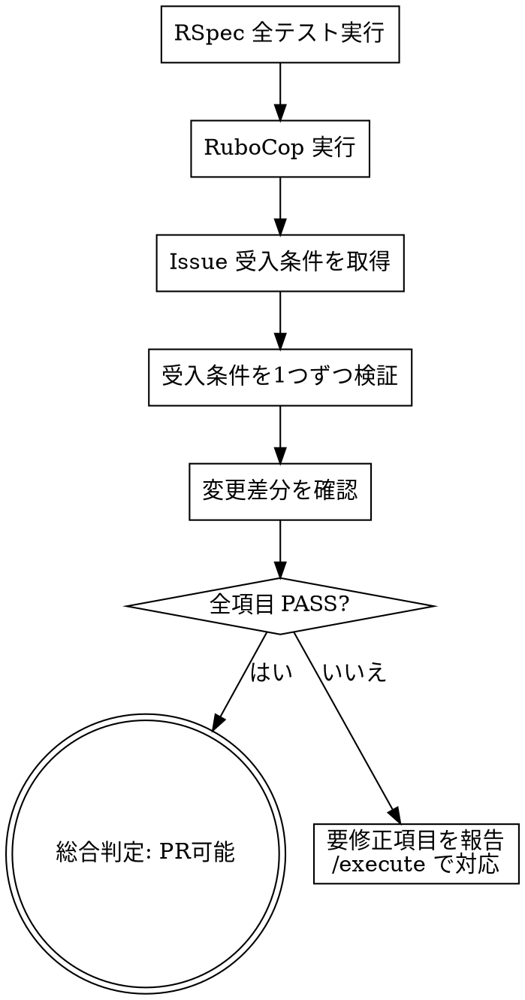

# PR前チェック

RSpec・RuboCop の実行に加え、要件との突合と証拠ベースの検証を行います。

## 鉄則

```
証拠なくして「完了」を主張しない
```

検証コマンドを実行し、出力を確認してから結果を報告する。
「たぶん通るはず」「正しそう」は禁止。

## プロセスフロー



## 依頼内容

$ARGUMENTS

## 実行手順

### 1. RSpec実行

```bash
docker compose exec web bundle exec rspec
```

- 出力を最後まで読む
- examples 数・failures 数・pending 数を記録する
- 失敗がある場合は失敗テストの内容と原因を記録する

### 2. RuboCop実行

```bash
docker compose exec web bundle exec rubocop
```

- offenses 数を記録する
- 違反がある場合は違反内容を記録する

### 3. 要件チェックリスト突合

関連する Issue の受入条件を確認し、1つずつ検証する：

```bash
gh issue view <Issue番号> --json body
```

| 受入条件 | 検証方法 | 結果 |
|---|---|---|
| 条件1 | テストで確認 / 目視確認 / コード確認 | PASS / FAIL |
| 条件2 | ... | ... |

**テストが通っている ≠ 要件を満たしている。** 受入条件を1つずつ確認する。

### 4. 変更差分の確認

```bash
git diff main...HEAD --stat
```

- 意図しないファイルが含まれていないか
- `.env` やクレデンシャルファイルが含まれていないか
- 不要なデバッグコードが残っていないか

### 5. 結果報告

以下のフォーマットで報告する：

```
## チェック結果

| 項目 | 結果 | 詳細 |
|---|---|---|
| RSpec | PASS / FAIL | X examples, X failures |
| RuboCop | PASS / FAIL | X offenses detected |
| 受入条件 | X/Y 項目クリア | 未達項目があれば列挙 |
| 差分確認 | OK / 要確認 | 不審なファイルがあれば列挙 |

### 総合判定：PR可能 / 要修正

**要修正の場合：**
- 修正が必要な項目と対応方針を列挙
```

### 6. 失敗時の対応

- RSpecが失敗 → 失敗テストの内容と原因を報告
- RuboCopが失敗 → 違反内容を報告し、自動修正可能か確認
- 受入条件未達 → 未達の条件と不足している実装を報告
- 修正は行わず報告のみ。修正が必要な場合は `/execute` で対応する

## 禁止事項

| 禁止 | 代わりにやること |
|---|---|
| 「should pass」「たぶん大丈夫」 | コマンドを実行して出力を確認する |
| 部分的なテスト実行で「全テスト通過」 | `bundle exec rspec`（全テスト）を実行する |
| テスト通過のみで「完了」 | 受入条件との突合を行う |
| 前回の実行結果を使い回す | 今回の実行結果を使う |
