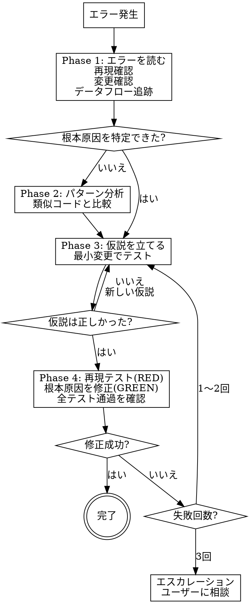

# 体系的デバッグ

> **推奨モデル: opus** — 根本原因の特定には深い推論が必要です。
> 現在のモデルが opus でない場合、ユーザーに「デバッグでは opus 推奨です。`/model opus` で切り替えますか？」と確認する。

## 鉄則

```
根本原因を特定する前に修正してはならない
```

Phase 1 を完了していなければ、修正を提案できない。

## プロセスフロー



## 依頼内容

$ARGUMENTS

## Phase 1：根本原因の調査

**修正を試みる前に、以下をすべて実行する：**

### 1. エラーメッセージを丁寧に読む
- スタックトレースを最後まで読む
- 行番号・ファイルパス・エラーコードを記録する
- 「読み飛ばし」をしない

### 2. 再現を確認する
- 再現手順を特定する
- 毎回再現するか？間欠的か？
- 再現できない場合 → 推測で直さず、データを集める

```bash
docker compose exec web bundle exec rspec spec/path/to/failing_spec.rb
```

### 3. 最近の変更を確認する
- `git diff` / `git log --oneline -10` で直近の変更を確認
- 新しい依存関係・設定変更はないか
- 「何が変わったか」を特定する

### 4. データフローを追跡する
- 不正な値がどこで発生しているか？
- 何がその値を渡しているか？
- 源流まで遡る → 源流で修正する（症状ではなく原因を直す）

### 5. 調査結果を報告する

```
## 調査結果

**エラー:** [エラーメッセージ]
**発生箇所:** [ファイル:行番号]
**再現手順:** [手順]
**根本原因:** [特定した原因]
**根拠:** [なぜそう判断したか]
```

## Phase 2：パターン分析

### 1. 動作する類似コードを探す
- 同じコードベース内で正常に動いている類似コードを見つける

### 2. 差分を特定する
- 動作するコードと壊れたコードの違いをすべて列挙する
- 「それは関係ない」と決めつけない

## Phase 3：仮説と検証

### 1. 仮説を立てる
- 「Xが根本原因だと考える。理由はY」と明記する
- 曖昧にしない

### 2. 最小限の変更でテストする
- 仮説を検証する最小の変更を1つだけ行う
- 複数の修正を同時にしない

### 3. 結果を確認する
- 修正されたか → Phase 4 へ
- 修正されていない → 新しい仮説を立てる（追加修正を重ねない）

## Phase 4：修正の実装

### 1. 再現テストを書く（TDD）
- まず失敗するテストを書く
- テストが失敗することを確認する

```bash
docker compose exec web bundle exec rspec spec/path/to/file_spec.rb
```

### 2. 根本原因を修正する
- 症状ではなく原因を直す
- 1つの変更だけ行う
- 「ついでに」のリファクタリングはしない

### 3. 修正を検証する

```bash
docker compose exec web bundle exec rspec spec/path/to/file_spec.rb
docker compose exec web bundle exec rspec  # 全テスト
docker compose exec web bundle exec rubocop
```

### 4. 3回修正に失敗した場合 → 停止

**以下のパターンはアーキテクチャの問題を示す：**
- 修正するたびに別の場所で新しい問題が発生する
- 修正に「大規模なリファクタリング」が必要になる
- 修正が別の症状を生む

**この場合：**
- 追加の修正を試みない
- 「このパターン自体が正しいか？」を疑う
- AskUserQuestionでユーザーに相談する

## 危険信号 — 以下の思考が浮かんだら STOP

| 思考 | 現実 |
|---|---|
| 「とりあえず直してみよう」 | 根本原因を調査していない |
| 「たぶんXだと思う、直そう」 | 仮説を検証していない |
| 「複数の修正をまとめて試そう」 | 何が効いたか分からなくなる |
| 「テストは後で書こう」 | テストなしの修正は信頼できない |
| 「もう1回だけ修正を試そう」（3回目以降） | アーキテクチャを疑うべき |
| 「完全には理解してないけど動くかも」 | 理解してから修正する |

## ルール

- 根本原因の特定前に修正コードを書かない
- 1回に1つの仮説だけ検証する
- 再現テストを書いてから修正する（TDD）
