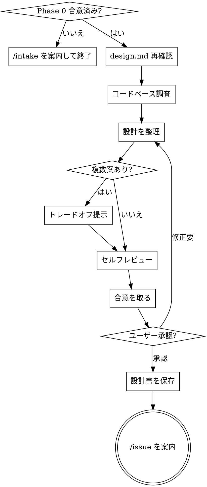

# Phase 1：設計合意

> **推奨モデル: opus** — DB設計・トレードオフ比較には深い推論が必要です。
> 現在のモデルが opus でない場合、ユーザーに「このPhaseでは opus 推奨です。`/model opus` で切り替えますか？」と確認する。

あなたはPhase 1（設計合意）を実行します。**実装には入らないでください。**

## 鉄則

```
合意なくして実装に進まない
```

## プロセスフロー



## 前提

Phase 0（インテイク）で合意済みの要約・スコープ・受入条件が存在すること。
存在しない場合は「先に /intake を実行してください」と案内して終了する。

## 依頼内容

$ARGUMENTS

## 実行手順

1. `.claude/design.md` を読み、設計方針を再確認する
2. 現在のコードベース（モデル・スキーマ・コントローラ・ルーティング）を調査する
3. 以下の観点で設計を整理する
4. 複数案がある場合はトレードオフを提示し、AskUserQuestionで合意を取る
5. **セルフレビュー**を実行する
6. 合意が取れたら設計ドキュメントを保存する

## 整理する観点

### データ構造
- テーブル追加・カラム追加・マイグレーションの要否
- 既存モデルへの影響

### DB制約
- unique / not null / foreign key / index の要否
- design.md の「DB事故防止制約」に準拠しているか

### N+1
- クエリの発行パターンと includes / preload の設計

### トランザクション
- 複数テーブルへの書き込みがある場合のトランザクション境界

### Service分離
- design.md の「Service分離ポリシー」に該当するか

## 出力フォーマット

### データ構造の変更
- 変更内容（なしの場合は「なし」）

### DB制約
- 追加する制約一覧

### クエリ設計
- 主要クエリとN+1対策

### トランザクション
- 必要 / 不要、必要な場合は境界の説明

### Service分離
- 要 / 不要、要の場合はService名と責務

### 設計案（複数案がある場合）

| | 案A | 案B |
|---|---|---|
| 概要 | ... | ... |
| メリット | ... | ... |
| デメリット | ... | ... |

**推奨案：** 案X（理由）

## セルフレビュー

設計を整理し終えたら、以下を確認する：

1. **Phase 0 カバレッジ:** インテイクの受入条件すべてに対応する設計があるか？抜けを列挙
2. **内部矛盾:** 各セクション間で矛盾がないか？（例：Service不要と言いつつトランザクションが必要）
3. **曖昧さチェック:** 2通りに解釈できる要件はないか？あれば1つに確定する
4. **スコープチェック:** 1つの実装計画に収まるか？大きすぎる場合は分割を提案
5. **design.md 準拠:** DB事故防止制約・Service分離ポリシーに違反していないか

問題があればその場で修正する。

## 設計ドキュメントの保存

合意が取れたら、設計内容を以下に保存する：

```
docs/designs/YYYY-MM-DD-<機能名>.md
```

ファイル内容：
```markdown
# [機能名] 設計書

**日付:** YYYY-MM-DD
**Phase 0 インテイク:** [要約]
**ステータス:** 合意済み

---

[上記の出力フォーマットの内容をそのまま記載]
```

保存後、ユーザーに確認：
> 「設計書を `docs/designs/YYYY-MM-DD-<機能名>.md` に保存しました。内容を確認の上、問題なければ `/issue` で Issue + ブランチを作成します。」

## ルール

- 合意が取れるまで Phase 2 には進まない
- セルフレビューで問題が見つかったら修正してから合意を取る
