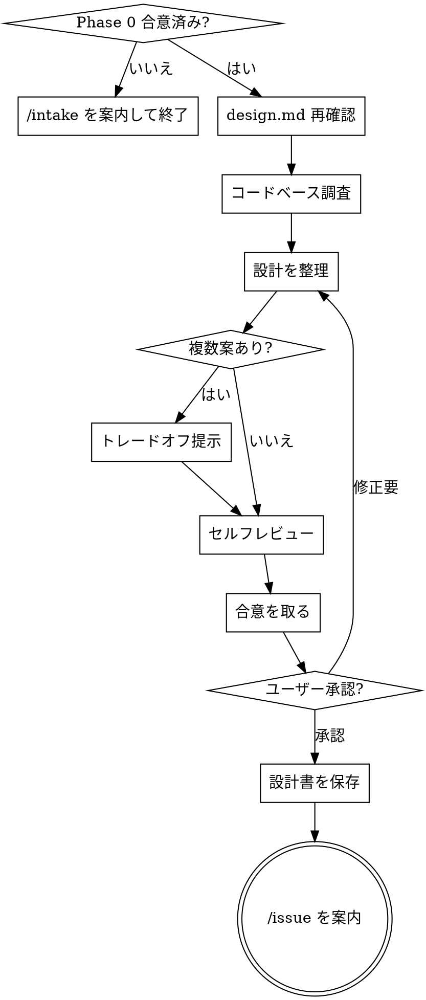
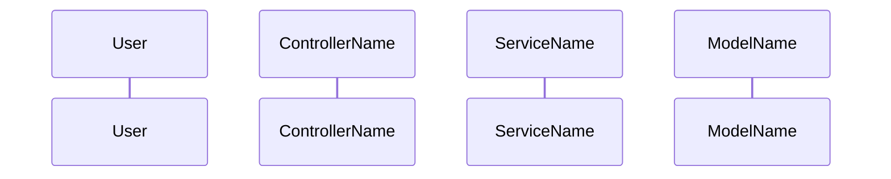

# Phase 1：設計合意

> **推奨モデル: opus** — DB設計・トレードオフ比較には深い推論が必要です。
> 現在のモデルが opus でない場合、ユーザーに「このPhaseでは opus 推奨です。`/model opus` で切り替えますか？」と確認する。

あなたはPhase 1（設計合意）を実行します。**実装には入らないでください。**

## 鉄則

```
合意なくして実装に進まない
```

## プロセスフロー



## 前提

Phase 0（インテイク）で合意済みの要約・スコープ・受入条件が存在すること。
存在しない場合は「先に /intake を実行してください」と案内して終了する。

## 依頼内容

$ARGUMENTS

## 実行手順

1. `.claude/design.md` を読み、設計方針を再確認する
2. 現在のコードベース（モデル・スキーマ・コントローラ・ルーティング）を調査する
3. 以下の観点で設計を整理する
4. 複数案がある場合はトレードオフを提示し、AskUserQuestionで合意を取る
5. **セルフレビュー**を実行する
6. 合意が取れたら設計ドキュメントを保存する

## 整理する観点

### データ構造
- テーブル追加・カラム追加・マイグレーションの要否
- 既存モデルへの影響

### DB制約
- unique / not null / foreign key / index の要否
- design.md の「DB事故防止制約」に準拠しているか

### N+1
- クエリの発行パターンと includes / preload の設計

### トランザクション
- 複数テーブルへの書き込みがある場合のトランザクション境界

### Service分離
- design.md の「Service分離ポリシー」に該当するか

## 出力フォーマット

各セクションには必ず **設計意図**（なぜその設計にしたか・別案を採用しなかった理由）を記載すること。
セクションは必ず「何を作るか → なぜその設計か → どう作るか → 完了条件 → 結論」の順で出力する。

### 1. この設計で作るもの
- 今回構築するものを箇条書きで列挙する
- 後続 Issue や依存関係があれば明記する

### 2. 目的
- この設計が解決する問題・達成する目標を 1〜3 点で明示する

### 3. スコープ
#### 含むもの
- 今回の実装範囲を列挙する

#### 含まないもの
- 意図的に除外した機能・要素を列挙する（将来対応の場合はその旨を記載）

### 4. 設計方針
- この機能の設計における主要な判断とその根拠
- 複数案があった場合はトレードオフ表で示す

| 方式 | 実装コスト | 拡張性 | 現状との相性 |
|---|---|---|---|
| 案A | ... | ... | ... |
| 案B | ... | ... | ... |

**採用理由:** 案Xを選んだ理由

### 5. データ設計
- 変更内容（なしの場合は「なし」）
- **設計意図:** なぜこの構造にしたか

#### DB 制約
| カラム | 制約 | 理由 |
|---|---|---|

#### ER 図（必須）
機能に関係するテーブルをMermaid erDiagramで必ず出力する。
変更がないテーブルも関連するものは含める。

> 列の構成: `型` | `カラム名` | `キー` | `制約・備考`

```mermaid
erDiagram
  例: テーブル名 {
    型 カラム名 PK/FK "備考"
  }
```

### 6. 画面・アクセス制御の流れ
- アクセス判定の順序や画面遷移を説明する

#### シーケンス図（必須）
主要なリクエスト〜レスポンスの処理フローをMermaid sequenceDiagramで必ず出力する。
Controller → Service → Model（Repository）の呼び出し順を示す。
**注意:** participant 名に `::` を含むと Mermaid が崩れるため、`as` でラベルを短縮する。



### 7. アプリケーション設計
- コントローラ・サービス・モデルの実装方針
- コードスニペットがある場合はここに記載する
- **設計意図:** 各クラス・メソッドの責務分割の根拠

### 8. ルーティング設計（該当する場合）
- 追加・変更するルーティングの定義
- **設計意図:** URL設計・namespace構成の判断根拠

### 9. レイアウト / UI 設計（該当する場合）
- レイアウト方針と採用案の理由
- 将来の変更タイミングの判断基準があれば明示する

### 10. クエリ・性能面
- 主要クエリとN+1対策
- 追加インデックスの要否と理由
- **設計意図:** クエリ設計の判断根拠

### 11. トランザクション / Service 分離
**トランザクション:** 必要 / 不要（必要な場合は境界の説明）
**Service 分離:** 要 / 不要（要の場合はService名と責務）
- **設計意図:** それぞれの判断根拠

### 12. 実装対象一覧

| # | 対象 | 内容 |
|---|---|---|
| 1 | Migration | ... |
| 2 | Model | ... |
| 3 | Controller | ... |

### 13. 受入条件

- [ ] 条件1
- [ ] 条件2

### 14. この設計の結論
- 設計全体の方針をひとことで締める
- 将来の拡張指針があれば明記する

## セルフレビュー

設計を整理し終えたら、以下を確認する：

1. **Phase 0 カバレッジ:** インテイクの受入条件すべてに対応する設計があるか？抜けを列挙
2. **内部矛盾:** 各セクション間で矛盾がないか？（例：Service不要と言いつつトランザクションが必要）
3. **曖昧さチェック:** 2通りに解釈できる要件はないか？あれば1つに確定する
4. **スコープチェック:** 1つの実装計画に収まるか？大きすぎる場合は分割を提案
5. **design.md 準拠:** DB事故防止制約・Service分離ポリシーに違反していないか

問題があればその場で修正する。

## 設計ドキュメントの保存

合意が取れたら、設計内容を以下に保存する：

```
docs/designs/YYYY-MM-DD-<機能名>.md
```

ファイル内容：
```markdown
# [機能名] 設計書

**日付:** YYYY-MM-DD
**Issue:** #[番号]
**ステータス:** 合意済み

---

## 1. この設計で作るもの
## 2. 目的
## 3. スコープ
## 4. 設計方針
## 5. データ設計
## 6. 画面・アクセス制御の流れ
## 7. アプリケーション設計
## 8. ルーティング設計
## 9. レイアウト / UI 設計
## 10. クエリ・性能面
## 11. トランザクション / Service 分離
## 12. 実装対象一覧
## 13. 受入条件
## 14. この設計の結論
```

保存後、以下のコマンドで knowledge-base にもコピーする：

```bash
cp docs/designs/YYYY-MM-DD-<機能名>.md ~/workspace/miyaRY777/knowledge-base/knowledge/projects/HobbyMatching/
```

ユーザーに確認：
> 「設計書を `docs/designs/YYYY-MM-DD-<機能名>.md` に保存し、`knowledge-base/knowledge/projects/HobbyMatching/` にもコピーしました。内容を確認の上、問題なければ `/issue` で Issue + ブランチを作成します。」

## 設計書の修正

実装中や合意後に設計変更が必要になった場合、以下の基準で対応する：

| 変更の規模 | 判断基準 | 対応方法 |
|---|---|---|
| 軽微な修正 | 受入条件が変わらない（カラム名・メソッド名・実装の細部） | 設計書を直接 Edit + 変更理由を追記し、`**ステータス:** 変更済み` に更新 |
| 大きな変更 | 受入条件が変わる（スコープ・DB設計・アーキテクチャの方針変更） | `/design` を再実行して合意を取り直す |

**判断に迷ったら「受入条件が変わるか？」で判断する。**

## ルール

- 合意が取れるまで Phase 2 には進まない
- セルフレビューで問題が見つかったら修正してから合意を取る
