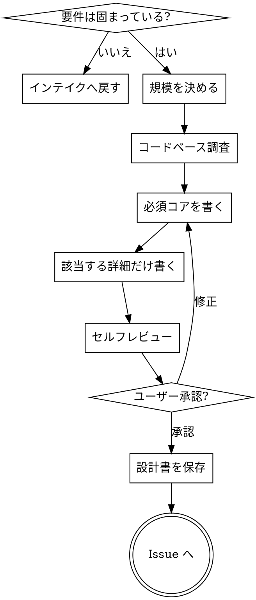
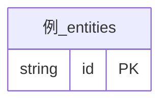

# Phase 1：設計合意

あなたは設計合意を実行します。**実装には入らないでください。**

このスキルの本文フォーマットは、Web / API / モバイルを含むアプリ開発向けの汎用型です。Rails 専用ではない。層の名前（Controller, Handler, Usecase 等）は、そのリポジトリの言葉に合わせる。

## 鉄則

```
合意なくして実装に進まない
未決の二択を、合意済みの本文に残さない
```

質問は **1回に1つ**。実装者が選べる状態で次の章へ進まない。

## 規模を先に決める

| 規模 | 使うとき | 書くもの |
|---|---|---|
| **短い** | 文言・見た目のみ。データ、認可、API 契約、状態遷移が変わらない | 必須コアだけ。詳細は「該当なし」と1行でよい |
| **通常** | 振る舞い・認可・データ・導線のいずれかが変わる | 必須コア + 該当する詳細 |
| **分割** | 独立してリリースできる塊が2つ以上ある | ここで止めて分割案を出す。1設計書に詰め込まない |

迷ったら **通常**。短いで始めて、データや認可が出てきたら通常に上げる。

## プロセスフロー


```dot
digraph design {
    "要件は固まっている?" [shape=diamond];
    "インテイクへ戻す" [shape=box];
    "規模を決める" [shape=box];
    "コードベース調査" [shape=box];
    "必須コアを書く" [shape=box];
    "該当する詳細だけ書く" [shape=box];
    "セルフレビュー" [shape=box];
    "ユーザー承認?" [shape=diamond];
    "設計書を保存" [shape=box];
    "Issue へ" [shape=doublecircle];

    "要件は固まっている?" -> "インテイクへ戻す" [label="いいえ"];
    "要件は固まっている?" -> "規模を決める" [label="はい"];
    "規模を決める" -> "コードベース調査";
    "コードベース調査" -> "必須コアを書く";
    "必須コアを書く" -> "該当する詳細だけ書く";
    "該当する詳細だけ書く" -> "セルフレビュー";
    "セルフレビュー" -> "ユーザー承認?";
    "ユーザー承認?" -> "必須コアを書く" [label="修正"];
    "ユーザー承認?" -> "設計書を保存" [label="承認"];
    "設計書を保存" -> "Issue へ";
}
```

## 前提

目的・スコープ・受入条件の方向が、インテイク等で合意されていること。未確定が大きいなら設計に入らず、先に質問する。

## 依頼内容

$ARGUMENTS

## 実行手順

1. リポジトリに設計方針ファイルがあれば読む（このリポジトリなら `.claude/design.md`）
2. コードベースを調べ、現状の入口・データ・認可を把握する
3. 規模（短い / 通常 / 分割）を決める
4. 必須コアを書く。複数案がある判断は比較表で示し、採用を1つに決める
5. 該当する詳細だけ書く。該当しない節は省略するか「該当なし」
6. セルフレビューする
7. ユーザー承認後に保存する

## 整理する観点（該当するものだけ）

- **永続化:** スキーマ変更の要否。一意性・必須・外部キーはアプリだけに頼らない
- **認可:** 誰が何を見られる / できるか。権限の主体と、クライアントが覚える ID を混ぜない
- **性能:** リスト取得で N+1 にならないか。インデックスの要否
- **一貫性:** 複数リソースを更新するなら、成功/失敗の境界
- **責務:** 入口（HTTP / ジョブ / UI）に手続きを溜めない。方針ファイルがあればそれに従う

## 出力フォーマット

順番は「何を作るか → なぜか → どう作るか → 完了条件 → 結論」。

**設計意図**は、判断した節にだけ書く。同じ文を全節にコピペしない。

**禁止する未決:** 「実装時に A でも B でもよい」「残してもよい」。説明文の「公開または非公開」のような、すでに意味が決まっている接続はよい。

比較表の列は固定しない。その案件の判断軸を列にする。

---

### 必須コア（どの規模でも書く）

#### 1. この設計で作るもの
- 成果物を箇条書きにする
- 後続作業や依存があれば書く

#### 2. 目的
- 1〜3点。何が良くなるか
- 後からコードを説明するための言葉があれば、ここに置く（例: 見る / 入る）

#### 3. スコープ
**含むもの / 含まないもの** を両方書く。含まないものは、将来やるならその旨を書く。

未確定が残っているなら、ここで止めて質問する。

#### 4. 方針
主要な判断と根拠。案が複数あるときは表で比較し、**採用を1つに決める。**

| 方式 | コスト | （今回の判断軸） | 現状との相性 |
|---|---|---|---|
| 案A | ... | ... | ... |
| 案B | ... | ... | ... |

**採用:** 案X。**設計意図:** なぜか、他を採らない理由。

認可や「クライアントが覚える ID」（Cookie, token, ローカル保存等）がある場合、**権限の主体とその ID を一致させる。** 資源で見るなら資源 ID、能力トークンで見るなら token。後の節で混ぜない。

#### 5. 受入条件
観察できる振る舞いだけ書く（画面、API レスポンス、データの有無）。実装クラス名だけを条件にしない。

用語・HTTP・文言の表と矛盾させない。

- [ ] 条件1
- [ ] 条件2

#### 6. 結論
方針をひとことで締める。残リスクと、意図的にやらない拡張があれば書く。

---

### 詳細（通常規模。該当する節だけ）

短い規模では、この塊は書かなくてよい。該当しない節は省略する。

#### 7. 言葉
ユーザー向けの言葉 ↔ コード上の実体。新しい概念や、同じフラグに二つの呼び方があるときに書く。

#### 8. データ
変更があるなら構造・制約・理由。変更がなければ「なし」でよい。

永続化モデルを触る、または既存関係が本設計の理解に必要なときだけ、Mermaid の ER を書く。文言修正では書かない。


```mermaid
erDiagram
  例_entities {
    string id PK
  }
```

**設計意図:** なぜこの持ち方か。

#### 9. 認可と流れ
誰が、どの入口で、何ができ、何が拒否されるか。HTTP や同等のステータスを使うなら表にする。

流れが非自明なら Mermaid の sequenceDiagram を書く。participant 名に `::` を使わない。

**設計意図:** なぜその境界か。

#### 10. 入口（ルーティング / API / 画面遷移）
追加・変更する URL や画面の入口。

**設計意図:** なぜその置き場所か。

#### 11. 画面と文言
導線。ユーザーに出る言葉を変えるなら、バッジ・本文・ボタン・フラッシュ・確認ダイアログまで表にする。受入条件が「画面に X と出ない」なら、表に無い残存を許さない。

**設計意図:** なぜその導線・文言か。

#### 12. 構成（モジュール境界）
どの層が何を持つか。使わなくなる API・画面・関数は、残すか消すかを決める。「残してもよい」は禁止。

**設計意図:** 責務をそう分ける理由。

#### 13. 性能と一貫性
主要クエリ、N+1、インデックス。複数更新があるならトランザクション境界。1件の読み取りだけなら「該当なし」。

**設計意図:** なぜその境界 / そのクエリか。

#### 14. 変更対象
本番とテストを分ける。テストは「関連テスト」でまとめず、ファイルパスを書く。

| # | 対象 | 内容 |
|---|---|---|
| 1 | 本番のパス | ... |
| 2 | テストのパス | ... |

## セルフレビュー

1つでも落ちていたら保存しない。

1. **要件カバー:** 合意した受入の方向が、設計の受入条件に落ちているか
2. **規模:** 短いのに詳細が肥大していないか。通常なのにデータや認可が空になっていないか
3. **内部矛盾:** 節同士が食い違っていないか
4. **未決:** 実装者が選べる二択が本文に残っていないか（説明の接続詞まで禁じない）
5. **認可キー:** 権限の主体と、覚える ID・戻り先が同じ軸か
6. **廃止:** 使わなくなる入口の残/消が決まっているか
7. **文言:** 画面の言葉が受入条件にあるなら、確認ダイアログまで表にあるか
8. **テスト地図:** 通常規模なら、壊れる / 新規のテストファイルが書いてあるか
9. **分割:** 1つの実装計画に収まるか
10. **リポジトリ方針:** 設計方針ファイルがあるなら、それに反していないか

## ステータス

| 値 | 意味 |
|---|---|
| 草案 | まだ合意していない |
| 合意済み | この内容で実装してよい |
| 変更済み | 合意後に直した。変更理由を冒頭に書く |

保存テンプレの初期値は、ユーザーが承認した直後なら `合意済み`。

## 設計ドキュメントの保存

このリポジトリでは次に保存する（正本は1つ。他ディレクトリへ複製しない）。

```
docs/designs/YYYY-MM-DD-<機能名>.md
```

```markdown
# [機能名] 設計書

**日付:** YYYY-MM-DD
**Issue:** #[番号] または 未採番
**ステータス:** 合意済み
**規模:** 短い | 通常 | （分割した旨）

---

## 1. この設計で作るもの
## 2. 目的
## 3. スコープ
## 4. 方針
## 5. 受入条件
## 6. 結論

（通常規模で該当するものだけ続ける）
## 7. 言葉
## 8. データ
## 9. 認可と流れ
## 10. 入口
## 11. 画面と文言
## 12. 構成
## 13. 性能と一貫性
## 14. 変更対象
```

既存の 1〜14 章（旧テンプレ）の設計書は、移行しなくてよい。これから書くものにこの型を使う。

ユーザーへ:

> 設計書を `docs/designs/YYYY-MM-DD-<機能名>.md` に保存しました。内容を確認の上、問題なければ Issue と作業ブランチに進みます。

## 設計書の修正

| 変更の規模 | 判断基準 | 対応 |
|---|---|---|
| 軽微 | 受入条件が変わらない | 設計書を Edit し、変更理由を追記。ステータスを `変更済み` にする |
| 大きい | 受入条件・スコープ・方針が変わる | 設計を合意し直す |

迷ったら「受入条件が変わるか？」で判断する。

## ルール

- 合意まで実装しない
- セルフレビューを通してから保存する
- 未決の実装二択を本文に残さない
- 該当しない詳細節は無理に埋めない
- このリポジトリの正本は `docs/designs/` のみ
