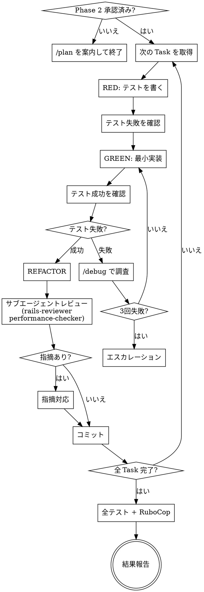

# Phase 3：実行

> **推奨モデル: sonnet** — コード生成・TDD は sonnet で十分です。複雑なバグ時のみ opus を検討。
> 現在のモデルが sonnet でない場合、ユーザーに「このPhaseでは sonnet 推奨です。`/model sonnet` で切り替えますか？」と確認する。

あなたはPhase 3（実行）を実行します。TDDを厳守してください。

## 鉄則

```
テストを先に書かないコードは書かない
```

## プロセスフロー



## 合理化テーブル（言い訳封じ）

| 言い訳 | 現実 |
|---|---|
| 「このテストは自明だから先に実装」 | 自明でもテストを先に書く。鉄則に例外はない |
| 「テストは後でまとめて書く」 | RED → GREEN → REFACTOR。順番を守る |
| 「小さい修正だからテスト不要」 | TDD省略条件（CLAUDE.md）を確認。迷ったらTDD |
| 「リファクタリングは後でまとめて」 | 各サイクルでREFACTOR。溜めない |
| 「サブエージェントのレビューは省略」 | REFACTOR時に必ず実行する |
| 「とりあえず動くものを作ってから」 | 「とりあえず」はTDD違反の始まり |

## サブエージェント駆動開発（SDD）

独立した Task が複数ある場合、サブエージェントを活用してコンテキストを隔離する：

- **Task ごとに新しいサブエージェントを起動** — 前の Task の試行錯誤やエラー履歴を持ち込ませない
- **レビューは独立したサブエージェントで実行** — 実装者と同じコンテキストでレビューしない
- 各サブエージェントの結果は必ず検証する（Agent の「成功」報告を鵜呑みにしない）

**SDD を使う条件：**
- Task 間に依存関係がない
- 各 Task が独立してテスト可能

**SDD を使わない条件：**
- Task 間でファイルの競合が起きる
- 前の Task の出力が次の Task の入力になる

## 前提

Phase 2（実装計画）で計画が承認済みであること。
承認がない場合は「先に /plan を実行してください」と案内して終了する。

## 依頼内容

$ARGUMENTS

## 実行手順

Phase 2 で合意した計画に従い、以下のサイクルを繰り返す：

### 1. RED（テストを先に書く）
- 失敗するテストを書く
- `docker compose exec web bundle exec rspec <対象ファイル>` で失敗を確認する
- 失敗出力を報告する

### 2. GREEN（最小実装）
- テストが通る最小限のコードを書く
- `docker compose exec web bundle exec rspec <対象ファイル>` で成功を確認する
- 成功を報告する

### 3. REFACTOR
- コードの改善点があればリファクタリングする
- サブエージェント（rails-reviewer / performance-checker）を並列実行する
- 指摘があれば対応し、ユーザーに報告する
- テストが引き続き通ることを確認する
- 改善内容を報告する

### 4. テスト失敗時の対応

- **1〜2回目:** `/debug` で根本原因を調査し、1つずつ修正
- **3回目:** **停止。** `/debug` のエスカレーションフォーマットで報告し、AskUserQuestionで相談

### 5. 次のサイクルへ
- 計画の次のステップへ進む
- 方針が分岐した場合はAskUserQuestionで確認する

## 各ステップの報告フォーマット

```
## Step N：RED / GREEN / REFACTOR

**何をしたか：** ...
**影響範囲：** ...
**次にやること：** ...
```

## 完了条件

すべてのステップが完了したら：

1. `docker compose exec web bundle exec rspec` で全テスト通過を確認
2. `docker compose exec web bundle exec rubocop` で違反なしを確認
3. 結果を報告する

## ルール

- 実装を先に書かない（テストファースト）
- 途中で方針が分岐したら停止してAskUserQuestionで確認する
- 高リスク操作（DB変更・既存テスト修正など）前は必ず確認する
- TDD省略条件（CLAUDE.md参照）に該当する場合のみ省略可

## テストの書き方ルール

- ログインユーザーの変数名は `current_user`、そのプロフィールは `current_profile` とする
- その他の変数も役割が伝わる名前にする。命名の基本方針：
  - 所有関係を `_の所有者名_` でつなぐ（例: `room_owners_room`, `room_owners_membership`）
  - 自分自身に関するものは `own_` プレフィックス（例: `own_room`, `own_membership`）
  - 他のメンバーに関するものは `other_member_` / `other_members_` プレフィックス（例: `other_member_profile`, `other_members_membership`）
  - 部屋の作成者は `room_owner` / `room_owner_profile`
- `user`, `profile`, `room`, `membership` などの汎用名は使わない
- 各セットアップ・リクエスト・アサーションには日本語コメントで意図を明記する
