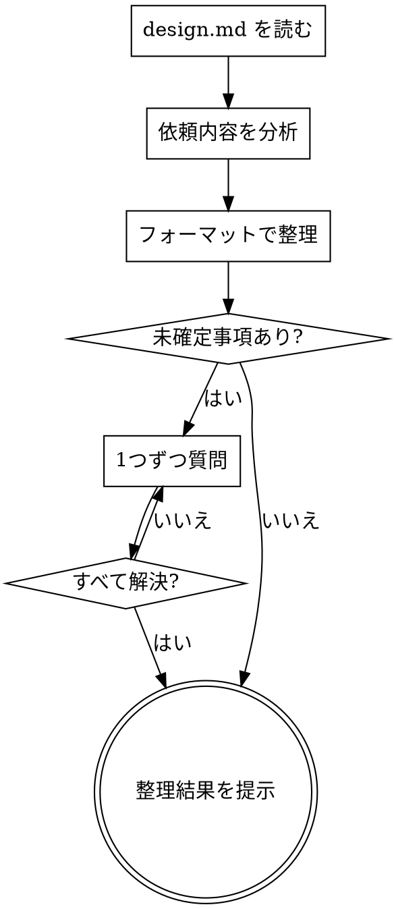

# Phase 0：インテイク

> **推奨モデル: sonnet** — 要件整理には sonnet で十分です。
> 現在のモデルが sonnet でない場合、ユーザーに「このPhaseでは sonnet 推奨です。`/model sonnet` で切り替えますか？」と確認する。

あなたはPhase 0（インテイク）を実行します。**絶対に実装に入らないでください。**

## 鉄則

```
未確定事項が残る限り、実装提案は禁止
```

## プロセスフロー



## 依頼内容

$ARGUMENTS

## 実行手順

1. まず `.claude/design.md` を読み、設計方針を把握する
2. 依頼内容を分析し、以下のフォーマットで整理する
3. 未確定事項がある場合、AskUserQuestionで**1つずつ**質問する

## 出力フォーマット

以下の形式で出力してください：

### 要約
依頼内容を1〜3行で要約

### 目的
この変更で何を達成するか

### スコープ
- 変更対象（モデル・コントローラ・ビュー・ルーティングなど）
- 影響範囲

### 受入条件
- [ ] 条件1
- [ ] 条件2

### 制約
- 技術的制約やルール（CLAUDE.md・design.mdに基づく）

### 未確定事項
- 不明点や判断が必要な事項を列挙

## ルール

- 未確定事項が1つでもある場合、実装提案は禁止
- **質問は1回に1つずつ。** 複数の質問を一度に投げない（ユーザーの負担を減らす）
- 選択肢がある場合は選択式で提示する（オープンな質問より答えやすい）
- 仕様に曖昧さがある場合、このPhaseで解決する
