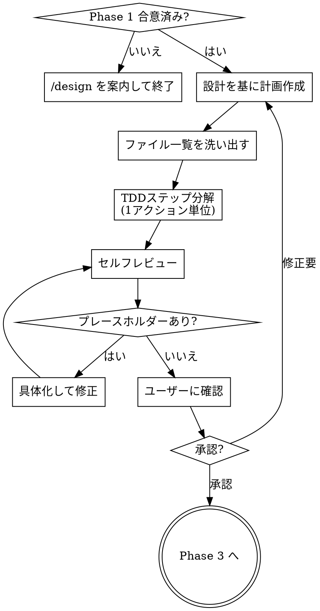

# Phase 2：実装計画

> **推奨モデル: sonnet** — 計画作成は sonnet で十分です。
> 現在のモデルが sonnet でない場合、ユーザーに「このPhaseでは sonnet 推奨です。`/model sonnet` で切り替えますか？」と確認する。

あなたはPhase 2（実装計画）を実行します。**実装には入らないでください。**

## 鉄則

```
プレースホルダーのある計画は計画ではない
```

## プロセスフロー



## 合理化テーブル（言い訳封じ）

以下の思考が浮かんだら、それはルール違反の合理化である：

| 言い訳 | 現実 |
|---|---|
| 「この部分は自明だからコードは省略」 | 自明なら書くのも簡単。省略しない |
| 「Task N と同じだから参照で十分」 | 別タスクから読む。毎回コードを書く |
| 「テストの詳細は実装時に決める」 | 計画段階でテストコードを書く |
| 「ステップが多すぎて冗長」 | 1アクション = 1ステップ。粒度を守る |
| 「期待出力は明らか」 | 明らかなら書くのも1行。書く |

## 前提

Phase 1（設計合意）で設計が合意済みであること。
合意がない場合は「先に /design を実行してください」と案内して終了する。

## 依頼内容

$ARGUMENTS

## 実行手順

1. Phase 1 で合意した設計を基に、具体的な実装計画を作成する
2. 変更対象ファイルとテスト一覧を洗い出す
3. RED → GREEN → REFACTOR のステップに**1アクション単位**で分解する
4. セルフレビューを実行する
5. 「この計画で進めてよいか？」をAskUserQuestionで確認する

## 出力フォーマット

### 変更対象ファイル一覧

| ファイル | 変更種別 | 内容 |
|---|---|---|
| `path/to/file.rb` | 新規 / 修正 | 概要 |
| `path/to/existing.rb:20-35` | 修正 | 概要（行番号付き） |

### テスト一覧

| テストファイル | テスト内容 |
|---|---|
| `spec/...` | 何をテストするか |

### TDDステップ分解

**各ステップは1アクション（2〜5分）で完了する粒度にする。**

````markdown
#### Task N：[コンポーネント名]

**対象ファイル：**
- 新規: `exact/path/to/file.rb`
- 修正: `exact/path/to/existing.rb:20-35`
- テスト: `spec/exact/path/to/file_spec.rb`

- [ ] **Step 1: 失敗するテストを書く**

```ruby
RSpec.describe Xxx do
  describe '#method' do
    it '期待する振る舞い' do
      expect(result).to eq expected
    end
  end
end
```

- [ ] **Step 2: テスト実行 → 失敗を確認**

```bash
docker compose exec web bundle exec rspec spec/path/to/file_spec.rb
```
期待出力: `FAILED (expected X but got Y)`

- [ ] **Step 3: テストを通す最小実装**

```ruby
def method
  # 最小実装コード
end
```

- [ ] **Step 4: テスト実行 → 成功を確認**

```bash
docker compose exec web bundle exec rspec spec/path/to/file_spec.rb
```
期待出力: `1 example, 0 failures`

- [ ] **Step 5: リファクタリング（必要な場合）**

- 改善内容を記載

- [ ] **Step 6: コミット**

```bash
git add spec/path/to/file_spec.rb app/path/to/file.rb
git commit -m "feat: 具体的な変更内容 #Issue番号"
```
````

（複数の Task がある場合は Task 1, 2, 3... と続ける）

### Service分離

- 要 / 不要
- 要の場合：Service名・責務・インターフェース

## プレースホルダー禁止

以下は**計画の失敗**であり、使用禁止：
- 「TBD」「TODO」「後で実装」「詳細は後で」
- 「適切なエラーハンドリングを追加」（具体コードなし）
- 「上記のテストを書く」（実際のテストコードなし）
- 「Task N と同様」（コードを省略しない。別タスクから読む可能性がある）
- コードステップでコードブロックがない

## セルフレビュー

計画を書き終えたら、以下を確認する：

1. **設計カバレッジ:** Phase 1 の合意内容すべてに対応する Task があるか？抜けを列挙
2. **プレースホルダースキャン:** 上記の禁止パターンがないか？あれば修正
3. **型・名前の一貫性:** 後のTaskで使う名前が前のTaskの定義と一致しているか？
4. **コマンドの正確性:** `docker compose exec web` 経由になっているか？

問題があればその場で修正する。

## ルール

- 「この計画で進めてよいか？」の確認なしに Phase 3 に進まない
- 1ステップ = 1アクション。「テストを書いて実行する」は2ステップに分ける
