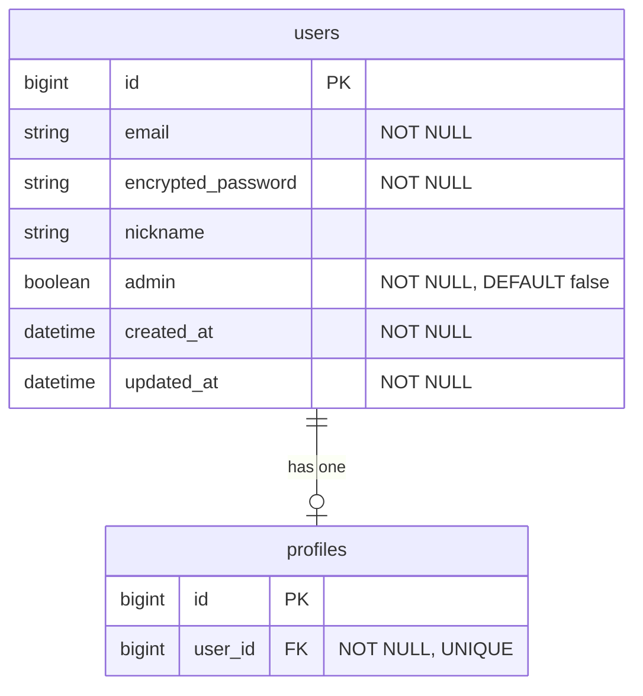

# 管理画面の基盤（admin権限 + レイアウト）設計書

**日付:** 2026-04-02
**Issue:** #170
**Phase 0 インテイク:** `users.admin` カラム追加、Admin::BaseController・DashboardsController、管理画面レイアウト・ルーティングを構築。未分類タグ管理画面（#171）の前提基盤。
**ステータス:** 合意済み

---

## 全体設計思想

### なぜ `boolean` カラムか（role ベースにしない理由）

管理者権限の実装には大きく2つのアプローチがある。

| | boolean カラム | role ベース（enum / 別テーブル） |
|---|---|---|
| 実装コスト | 低（カラム1つ + マイグレーション） | 高（enum定義 or 中間テーブル） |
| 拡張性 | 低（複数ロールが必要になったら移行が必要） | 高（moderator, editor 等を追加しやすい） |
| 現状の要件 | 「管理者か否か」の2値で十分 | 複数ロールは現時点で不要 |

**採用理由：** 現状の要件は「未分類タグを管理できる管理者」のみ。将来複数ロールが必要になった段階で `role` カラムへ移行する方が、過剰設計を避けられる。YAGNI（You Aren't Gonna Need It）の原則に従い `boolean` を採用。

---

## データ構造の変更

```ruby
# 新規マイグレーション
add_column :users, :admin, :boolean, null: false, default: false
```

**設計意図:** 既存ユーザーは `default: false` で自動的に非管理者になる。マイグレーション適用と同時に整合性が保たれるため、データパッチ不要。`User#admin?` は Rails が boolean カラムから自動生成するため、モデルコードの追加不要。

#### ER図



## DB制約

| カラム | 制約 | 理由 |
|---|---|---|
| `users.admin` | `null: false` | NULL による予期しない挙動（`nil.present?` 等）を防ぐ |
| `users.admin` | `default: false` | 新規ユーザーが誤って管理者になる事故防止 |
| index | 不要 | `current_user.admin?` は session 経由の単一レコード参照のみ。管理者一覧検索のユースケースは現状ない |

**設計意図:** boolean フラグは `null: false + default: false` をセットで設定するのが Rails のベストプラクティス。NULL が混入すると `admin?` が `nil` を返すケースが生じ、認可ロジックが破綻するリスクがある。

## クエリ設計

`current_user` は Devise が既にロード済み（追加クエリなし）。今回のダッシュボードは静的表示のみで N+1 の発生源なし。

**設計意図:** 管理者チェックは `current_user.admin?` の1属性参照のみ。セッションから取得済みのオブジェクトを使うため、DBへの追加クエリは発生しない。

#### シーケンス図

```mermaid
sequenceDiagram
  actor User
  participant Browser
  participant Admin::DashboardsController
  participant Admin::BaseController
  participant Devise

  User->>Browser: GET /admin
  Browser->>Admin::DashboardsController: request

  Admin::BaseController->>Devise: authenticate_user!
  alt 未ログイン
    Devise-->>Browser: redirect → /users/sign_in
  end

  Admin::BaseController->>Admin::BaseController: require_admin!（current_user.admin?）
  alt admin: false
    Admin::BaseController-->>Browser: redirect → / (alert: 権限がありません)
  end

  Admin::DashboardsController->>Browser: render admin/dashboards/show (200 OK)
```

## トランザクション

不要。DB 操作はマイグレーション（DDL）のみ。アプリロジック上の複数テーブル書き込みなし。

## Service分離

不要。認証・認可・ルーティング・レイアウトのみで、ビジネスロジックは存在しない。

**設計意図:** `before_action` による認可は Rails のイディオムであり、Controller に置くことが適切。ロジックが増えた場合（例：管理操作のログ記録）は Service 切り出しを検討する。

## コントローラ構成

```ruby
# app/controllers/admin/base_controller.rb
class Admin::BaseController < ApplicationController
  before_action :authenticate_user!
  before_action :require_admin!

  private

  def require_admin!
    redirect_to root_path, alert: "権限がありません" unless current_user.admin?
  end
end

# app/controllers/admin/dashboards_controller.rb
class Admin::DashboardsController < Admin::BaseController
  def show
  end
end
```

**設計意図:** `Admin::BaseController` を基底クラスにすることで、今後追加する管理コントローラ（例：`Admin::TagsController`）が自動的に認証・認可を継承できる。各コントローラで `before_action` を繰り返す必要がなく、認可漏れのリスクを構造的に排除できる。`authenticate_user!` を先に実行するのは、未ログイン状態で `current_user.admin?` を呼ぶと `NoMethodError` になるため。

## ナビゲーション設計

**採用案：ヘッダーナビ**

**設計意図:** 現時点のスコープはダッシュボード1画面のみ。サイドバーは多数のメニュー項目がある場合に威力を発揮するが、項目が少ない段階では実装コストが見合わない。ヘッダーナビで始め、管理機能が5項目を超えた時点でサイドバーへの移行を検討する。既存の `application.html.erb` もヘッダーナビ構造のため、設計の一貫性も保てる。

## 実装内容まとめ

| # | 対象 | 内容 |
|---|---|---|
| 1 | Migration | `users.admin boolean, null: false, default: false` |
| 2 | Model | 変更なし（`admin?` は自動生成） |
| 3 | Controller | `Admin::BaseController`（`authenticate_user!` + `require_admin!`） |
| 4 | Controller | `Admin::DashboardsController`（`show` のみ） |
| 5 | Routes | `namespace :admin { root "dashboards#show" }` |
| 6 | Layout | `layouts/admin.html.erb`（ダーク系テーマ + ヘッダーナビ） |
| 7 | View | `admin/dashboards/show.html.erb`（最小限のダッシュボード） |

## 受入条件

- [ ] `users.admin` カラムが追加されている（boolean, null: false, default: false）
- [ ] `/admin` に admin ユーザーのみアクセスできる
- [ ] 非adminユーザーはトップページにリダイレクト（alertあり）
- [ ] 未ログインユーザーはログイン画面にリダイレクト
- [ ] 管理画面ダッシュボードが表示される
- [ ] RSpec / RuboCop 全通過
