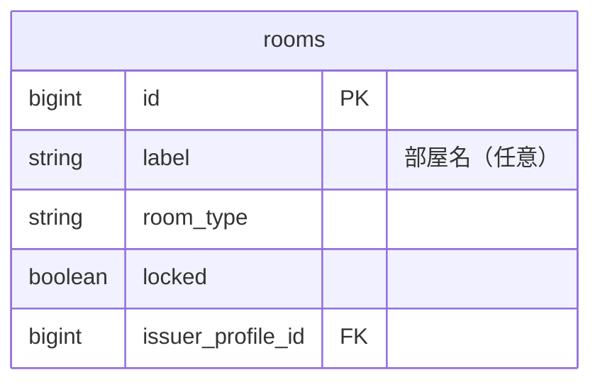
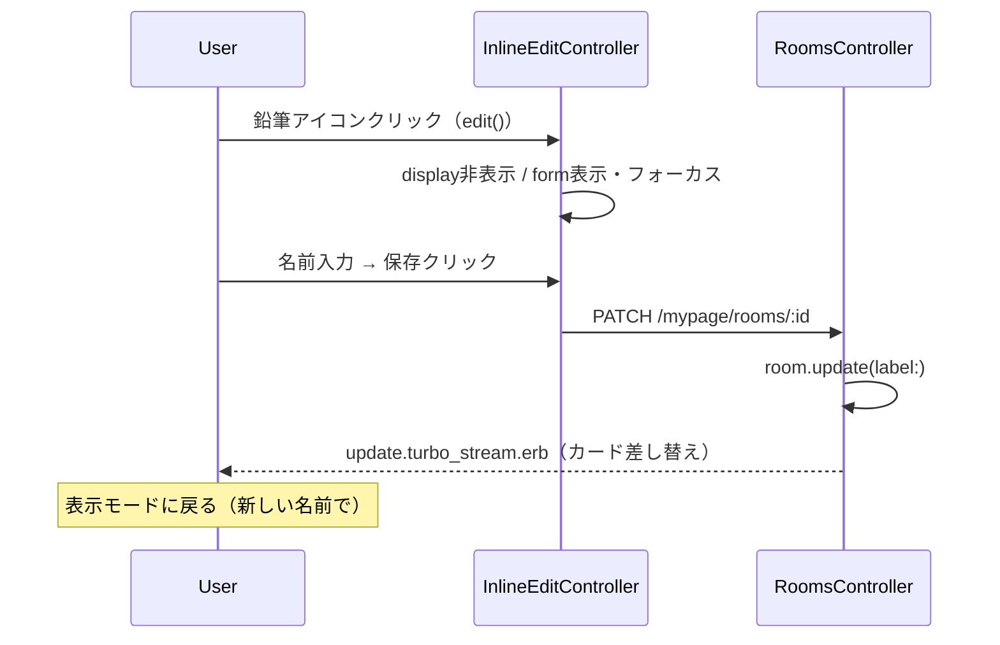

# 部屋名インライン編集 設計書

**日付:** 2026-04-12
**Issue:** #209（rooms UI改善 追加実装）
**ステータス:** 合意済み

---

## 1. この設計で作るもの

- `_room.html.erb` の部屋名（h3）横に鉛筆アイコンを追加
- アイコンクリックで部屋名がその場で入力フィールドに切り替わるインライン編集UI
- 既存の `inline_edit_controller.js` を再利用（変更なし）
- 「編集」ボタンを削除

## 2. 目的

- 部屋名を素早くインラインで変更できるUXを提供する
- 「編集」ボタン廃止でカードをすっきりさせる

## 3. スコープ

### 含むもの
- `_room.html.erb` の修正（インライン編集UI追加・「編集」ボタン削除）

### 含まないもの
- `inline_edit_controller.js` の変更（既存そのまま）
- コントローラ・モデル・ルーティングの変更
- `_form.html.erb` の削除（参照箇所はなくなるが削除は別対応）

## 4. 設計方針

| 方式 | 実装コスト | 既存との相性 |
|---|---|---|
| inline_edit_controller 再利用 | 低（ビューのみ変更） | ◎ |
| 新規コントローラ作成 | 高 | × |

**採用理由:** 既存の `inline_edit_controller.js` が `display`/`form` ターゲット切り替えパターンを持っており、ビュー変更のみで実現できる。

## 5. データ設計

変更なし。既存の `rooms.label` カラムを更新するのみ。



## 6. 画面・アクセス制御の流れ



## 7. アプリケーション設計

`_room.html.erb` の部屋名周辺を以下の構造に変更：

```html
<div data-controller="inline-edit">
  <!-- displayTarget: 初期表示 -->
  <div data-inline-edit-target="display" style="display:flex; align-items:center; gap:0.5rem;">
    <h3>部屋名</h3>
    <button type="button" data-action="click->inline-edit#edit">鉛筆SVGアイコン</button>
  </div>

  <!-- formTarget: 編集時（初期hidden） -->
  <div data-inline-edit-target="form" class="hidden">
    <%= form_with model: room, url: mypage_room_path(room), method: :patch do |f| %>
      <%= f.text_field :label, placeholder: "名無しの部屋" %>
      <%= f.submit "保存" %>
      <button type="button" data-action="click->inline-edit#cancel">キャンセル</button>
    <% end %>
  </div>
</div>
```

## 8. ルーティング設計

変更なし。既存 `PATCH /mypage/rooms/:id` を使用。

## 10. クエリ・性能面

変更なし。`index` の `includes(:share_link, :room_memberships)` はそのまま。

## 11. トランザクション / Service 分離

- **トランザクション:** 不要（単一カラム更新）
- **Service 分離:** 不要（単一モデル・単一カラム更新）

## 12. 実装対象一覧

| # | 対象 | 内容 |
|---|---|---|
| 1 | View | `app/views/mypage/rooms/_room.html.erb` - インライン編集UI追加・「編集」ボタン削除 |

## 13. 受入条件

- [ ] 部屋名横に鉛筆アイコンが表示される
- [ ] アイコンクリックで入力フィールドが表示され編集できる
- [ ] 「保存」でカードが差し替えられ新しい名前が表示される
- [ ] 「キャンセル」で元の表示に戻る
- [ ] 「編集」ボタンが削除されている

## 14. この設計の結論

ビュー変更のみ。JS・コントローラ・DB はすべて既存を再利用するシンプルな設計。
