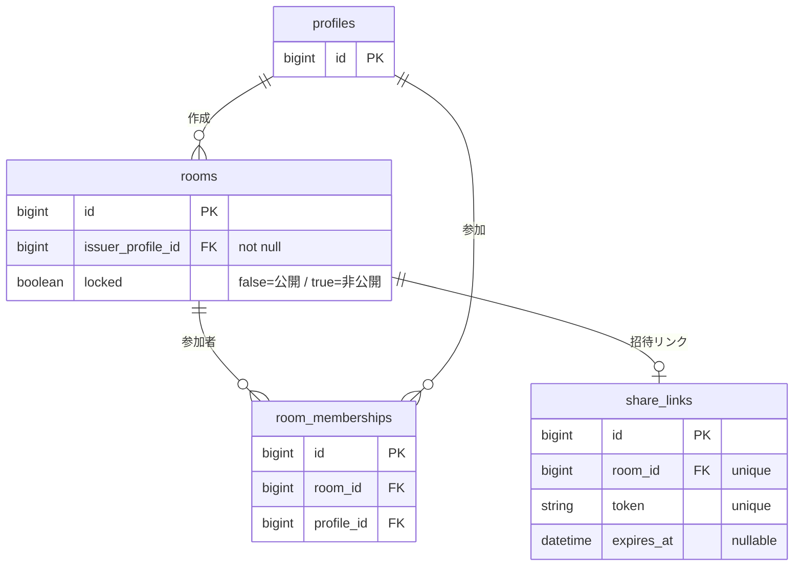
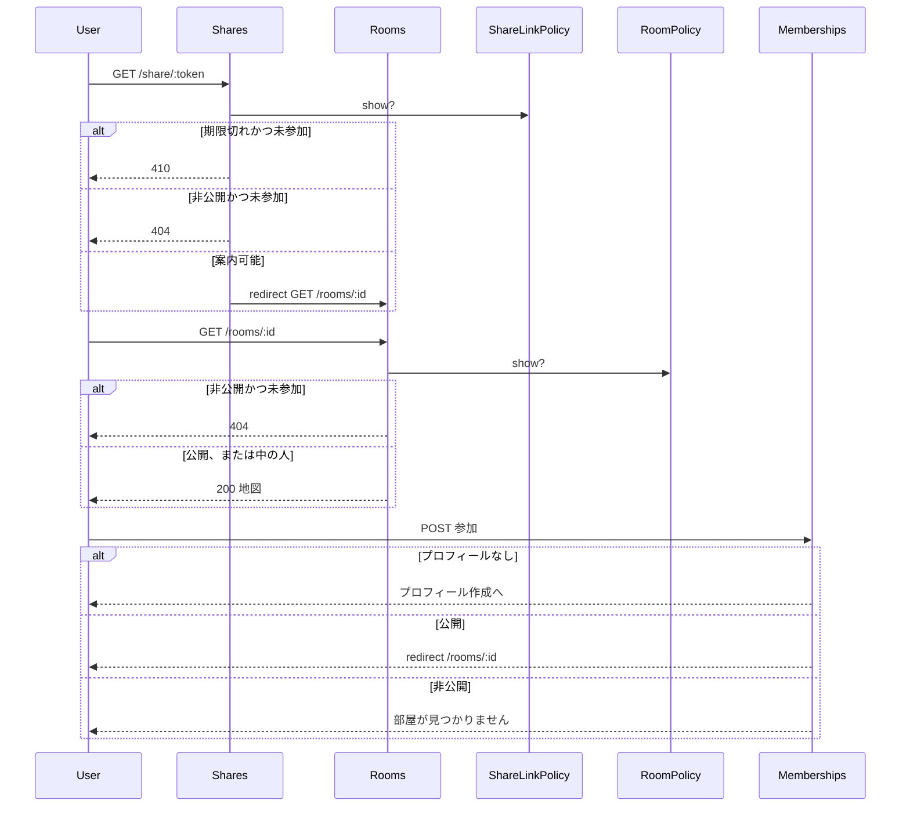

# 公開部屋の覗き（参加と閲覧の分離）設計書

**日付:** 2026-08-20
**Issue:** #294
**ステータス:** 変更済み
**規模:** 通常

**変更理由:** 設計テンプレを汎用型へ更新したのに合わせ、章立てを必須コア＋詳細に組み直した。あわせて `shares_show_*` の地図アサーションは部屋ページへ移す、と決めた。

---

## 1. この設計で作るもの

- 公開部屋を、参加せずに地図まで見られる部屋ページ `GET /rooms/:id`
- 招待リンクは部屋ページへの案内だけにする（自動参加をやめる）
- 公開部屋一覧の主操作を「覗く」にする（参加モーダルを外す）
- 公開部屋の未参加でもメンバー詳細・親タグ一覧を見られるようにする
- 画面の公開状態を「非公開」に揃える（確認ダイアログ含む）
- 使わなくなる `ShareLinkPolicy#join?` を削除する

後続: 限定公開（リンクを知っていれば非公開にも入れる）は別 Issue。

## 2. 目的

1. 「見る」と「入る」を分ける。公開部屋は参加せずに地図まで覗ける
2. 招待リンクの案内可否と、部屋の公開設定（`rooms.locked`）と責務を分ける
3. 画面の言葉を公開 / 非公開に揃え、コードを説明できる状態にする

## 3. スコープ

### 含むもの

- 部屋ページでの覗き（マインドマップ + メンバー詳細）
- 有効な招待リンクからの案内
- 期限切れリンクの 410（その URL では覗きも参加も不可）
- 非公開の未参加は 404
- 公開部屋一覧からの覗きと、部屋ページからの明示的な参加
- ナビ「部屋に戻る」を部屋の閲覧可否（`RoomPolicy#show?`）基準にする
- 文言の公開 / 非公開化
- `join?` の削除

### 含まないもの

- 未ログインの覗き
- 限定公開
- `rooms.locked` カラム名や `lock` / `unlock` アクション名の変更
- Cookie のキー名を token から room_id へ変えること
- 410 / 404 の HTML エラーページ
- 参加申請・承認
- 使い方ガイド本文の改稿

## 4. 方針

| 方式 | コスト | 招待リンクと公開設定の分離 | 現状との相性 |
|---|---|---|---|
| A. 地図を招待 URL に残し、一覧からも token を開く | 低 | 弱い | ◎ |
| **B. 地図を部屋ページに置く** | 中 | 強い | ○ |
| C. 一覧モーダルに地図を埋め込む | 中 | 中 | △ |

**採用:** 案B。

**設計意図:** 部屋の閲覧可否は `RoomPolicy`、招待リンクの有効期限は `ShareLinkPolicy`。期限切れ URL は 410 のまま、公開なら一覧から覗ける。自動参加は見るとは入るを同じ操作にしているので外す。

権限の主体は部屋。Cookie の token は「最後に見た部屋を思い出す鍵」に過ぎない。ナビに出すかは `RoomPolicy#show?` で決める。

## 5. 受入条件

- [ ] 公開部屋の未参加ユーザーが `GET /rooms/:id` で地図を見られ、参加レコードは増えない
- [ ] 公開部屋の未参加ユーザーがメンバー詳細・親タグ一覧を 200 で見られる
- [ ] 公開部屋の部屋ページに「参加する」があり、押すと参加して同じ部屋ページに戻る
- [ ] プロフィール未作成でも公開部屋を覗ける。参加するときだけプロフィール作成へ誘導される
- [ ] 有効な招待リンクは `/rooms/:id` へリダイレクトし、その時点では参加しない
- [ ] 期限切れリンクの未参加は 410。地図は出ない。参加もしない
- [ ] 非公開部屋の未参加は部屋・招待リンク・メンバー詳細・親タグ一覧が 404
- [ ] 非公開でも既存メンバーと作成者は部屋ページを見られる
- [ ] 期限切れリンクでも、公開部屋なら一覧の「覗く」から見られる・参加できる
- [ ] 公開部屋一覧に「覗く」があり、参加モーダルは出ない
- [ ] 参加済み / 作成した部屋は一覧から「見る」で部屋ページを開ける
- [ ] 部屋の公開状態として画面に「ロック中」「ロックする」「ロックを解除」が出ない
- [ ] 「部屋に戻る」は、見られる部屋なら `/rooms/:id`。期限切れ token でも公開なら戻れる。見られない部屋ならリンクを出さない
- [ ] 参加判定用の `join?` はコードに残らない
- [ ] RSpec / RuboCop 全通過

## 6. 結論

地図の本体は部屋ページ。招待リンクは案内だけ。公開は未参加でも見られる。非公開は未参加に存在を認めない。期限切れの招待リンク URL では何もできない。ナビは部屋の閲覧可否基準で部屋に戻す。参加は自分を地図に載せる明示操作。

残リスク: 公開部屋の ID は推測できる。410 / 404 は本文なしのまま。限定公開はこの設計ではできない。

---

## 7. 言葉

| 言葉 | 実体 |
|---|---|
| 見る（覗く） | `RoomPolicy#show?` が true なら地図を出す。参加レコードは作らない |
| 参加する | 公開部屋への membership 作成。プロフィール必須 |
| 招待リンク | `ShareLink`。期限切れの未参加がその URL を開くと 410 |
| 公開設定 | `rooms.locked`（false=公開 / true=非公開）。非公開の未参加は 404 |
| 部屋に戻る | token から部屋を思い出し、`RoomPolicy#show?` が true なら部屋ページ。無ければナビに出さない |

画面は「非公開」、コードは `locked` のまま。同じフラグの二つの呼び方であり、カラム名は変えない。

**用語整理（2026-08-21）:** 開発者向けの比喩「見る権利」「入場券」「扉」はやめ、上記の Policy 名・画面用語に揃えた。

## 8. データ

変更: **なし。**

既存の `rooms.locked` を公開設定、`share_links.token` / `expires_at` を招待リンクとして使う。

| カラム | 制約 | 理由 |
|---|---|---|
| `share_links.token` | unique | 招待リンク token の一意性 |
| `share_links.room_id` | unique | 1部屋1招待リンク |
| `room_memberships(room_id, profile_id)` | unique | 二重参加防止 |



**設計意図:** 公開の覗きは新しい状態ではなく、見るから入るを外す変更。スキーマも Cookie キー名も増やさない。

## 9. 認可と流れ

ログイン必須。プロフィールは覗き不要、参加には必要。

| 状況 | 結果 |
|---|---|
| 未参加 × 期限切れの `/share/:token` | 410 |
| 未参加 × 非公開（部屋・リンク・メンバー詳細・親タグ） | 404 |
| 公開 × 未参加（部屋ページ、または有効リンクからの案内） | 200。参加レコードは増えない |
| 既存メンバー / 作成者 | 200 |
| 存在しない token / room_id | 404 |

部屋の閲覧可否（`RoomPolicy#show?`）:

- 公開 → ログイン済みなら可
- 非公開 → メンバーまたは作成者だけ

招待リンクの判定順（`ShareLinkPolicy#show?`）:

1. メンバーまたは作成者 → 通す（期限切れ・非公開でも部屋へ案内する）
2. 期限切れ → 410
3. 非公開 → 404
4. それ以外 → 通す（公開かつ有効）



**設計意図:** 有効期限は招待リンク、公開/非公開は部屋。混ぜない。非公開の中の人を通すため、見せるときは公開部屋スコープで find しない。

## 10. 入口

```ruby
resources :rooms, only: %i[index show]
get "/share/:token", to: "shares#show", as: :share
```

- 一覧「覗く / 見る」→ `GET /rooms/:id`
- 有効な招待リンク → 認可後に `GET /rooms/:id` へリダイレクト
- 参加 → 既存の `POST /mypage/room_memberships`（成功後は `room_path`）

既存の `GET /rooms/:room_id/members/:id` とは衝突しない。

**設計意図:** 見る URL は部屋 ID。token は招待リンク URL のまま。

## 11. 画面と文言

公開部屋一覧:

- 未参加 → **覗く**（部屋ページ）
- 参加済み / 作成した部屋 → **見る**（同じ部屋ページ）
- 参加モーダルは外す

部屋ページ（現行の共有ページを移す）:

- 公開かつ未参加 → 案内 + **参加する**
- 参加済み → 参加ボタンなし
- 非公開かつ中の人 → 非公開の案内
- プロフィールなし → 地図は見える。参加するを押すと作成へ

| 場所 | 変更前 | 変更後 |
|---|---|---|
| 部屋ページバッジ | ロック中 | 非公開 |
| 部屋ページ案内 | この部屋は現在ロック中です。新しいメンバーは参加できません。 | この部屋は非公開です。新しいメンバーは参加できません。 |
| 公開中の案内 | この部屋は公開中です。気になるメンバーを選んでください。 | 変更なし |
| 一覧ボタン | 参加する（モーダル） | 覗く / 見る |
| マイページメニュー | ロックする / 解除する | 非公開にする / 公開する |
| 確認ダイアログ | この部屋をロックしますか？ / この部屋のロックを解除しますか？ | この部屋を非公開にしますか？ / この部屋を公開しますか？ |
| フラッシュ | 部屋をロックしました / 部屋のロックを解除しました | 非公開にしました / 公開しました |

Devise のアカウントロック文言は対象外。テスト例の名前に「ロック」が残っても、画面に出なければよい。

**設計意図:** 参加判断は地図を見てから行う。画面の言葉は公開 / 非公開に揃える。

## 12. 構成

| 役割 | 担当 |
|---|---|
| 見る | `RoomsController#show` + `RoomPolicy#show?` |
| 招待リンクの案内 | `SharesController#show` + `ShareLinkPolicy#show?` |
| 参加 | 既存の memberships#create（公開部屋のみ） |
| メンバー詳細 / 親タグ | 既存コントローラ。認可を `RoomPolicy#show?` に合わせ、失敗は 404 |
| 地図データ | 既存 `JsmindDataBuilder` |
| 部屋に戻る | `recent_room_nav_path`。`RoomPolicy#show?` が true なら `room_path`。410 へは誘導しない |

廃止（消す）:

- `ShareLinkPolicy#join?` とそのテスト
- `app/views/shares/show.html.erb`（リダイレクト専用になるため）
- 一覧の参加モーダル
- 共有ページの `require_profile!`（覗きを止めていたため）

**設計意図:** 見るは部屋、招待リンクは案内、参加は別操作。使わない参加 Policy を残すと、後から読み違える。

## 13. 性能と一貫性

部屋ページのメンバー取得は現行共有ページと同じ（N+1 防止の `includes` を維持）。追加インデックスなし。一覧に token を出さない。

トランザクション: 覗きは読み取りのみ。参加は membership 1件のまま。新しい Service は作らない。

**設計意図:** 手続きの追加は「描画しない / リダイレクトする」だけなので、切り出し対象ではない。

## 14. 変更対象

### 本番

| # | 対象 | 内容 |
|---|---|---|
| 1 | `config/routes.rb` | `rooms` に `show` |
| 2 | `app/policies/room_policy.rb` | 新規。`show?` |
| 3 | `app/policies/share_link_policy.rb` | 判定順を明示。`join?` を削除 |
| 4 | `app/controllers/rooms_controller.rb` | `#show`。自動参加なし |
| 5 | `app/controllers/shares_controller.rb` | 認可後リダイレクト。`require_profile!` 削除 |
| 6 | `app/views/rooms/show.html.erb` | 共有ページから移動 |
| 7 | `app/views/shares/show.html.erb` | 削除 |
| 8 | `app/views/rooms/_room.html.erb` | 覗く / 見る。モーダル削除 |
| 9 | `app/controllers/rooms/members_controller.rb` | `RoomPolicy#show?`。失敗は 404 |
| 10 | `app/controllers/rooms/parent_tag_members_controller.rb` | 同上 |
| 11 | `app/controllers/mypage/room_memberships_controller.rb` | 参加後 `room_path` |
| 12 | `app/helpers/application_helper.rb` | `RoomPolicy#show?` が true なら `room_path` |
| 13 | `app/views/mypage/rooms/_room.html.erb` | 非公開にする / 公開する |
| 14 | `app/controllers/mypage/rooms_controller.rb` | フラッシュ |

### テスト

地図・ヘッダー・メンバー順のアサーションは **部屋ページ側へ移す。** 招待 URL の spec はリダイレクトと 410 / 404 だけ残す。

| # | 対象 | 内容 |
|---|---|---|
| 15 | `spec/policies/room_policy_spec.rb` | 新規 |
| 16 | `spec/policies/share_link_policy_spec.rb` | `show?` の順序。`join?` を削除 |
| 17 | `spec/requests/rooms_spec.rb` | `#show` の覗き・404・参加しない |
| 18 | `spec/requests/shares_spec.rb` | リダイレクト / 410 / 404。自動参加しない |
| 19 | `spec/requests/shares/shares_show_join_spec.rb` | 参加しないことへ更新 |
| 20 | `spec/requests/shares/shares_show_expired_spec.rb` | 410。プロフィールなしでも招待リンク判定する |
| 21 | `spec/requests/shares/shares_show_no_profile_spec.rb` | プロフィールなしでも案内される |
| 22 | `spec/requests/shares/shares_show_jsmind_spec.rb` | 部屋ページへ移す |
| 23 | `spec/requests/shares/shares_show_room_header_spec.rb` | 部屋ページへ移す |
| 24 | `spec/requests/shares/shares_show_room_label_spec.rb` | 部屋ページへ移す |
| 25 | `spec/requests/shares/shares_show_members_order_spec.rb` | 部屋ページへ移す |
| 26 | `spec/requests/shares/shares_show_auth_spec.rb` | リダイレクト前提に更新 |
| 27 | `spec/requests/rooms/members_show_spec.rb` | 公開未参加 200、非公開未参加 404 |
| 28 | `spec/requests/rooms/parent_tag_members_index_spec.rb` | 同上 |
| 29 | `spec/requests/mypage/rooms_spec.rb` | フラッシュ・確認の文言 |
| 30 | `spec/requests/rooms_spec.rb` の参加 / memberships | 参加後 `room_path` |
| 31 | `spec/helpers/application_helper_spec.rb` | 公開なら期限切れ token でも `room_path` |
| 32 | `spec/views/shares/show.html.erb_spec.rb` | `rooms/show` へ移す |
| 33 | `spec/system/shares/layout_stability_spec.rb` | 部屋ページへ |
| 34 | `spec/system/rooms_spec.rb` | 「覗く」。モーダルなし |
